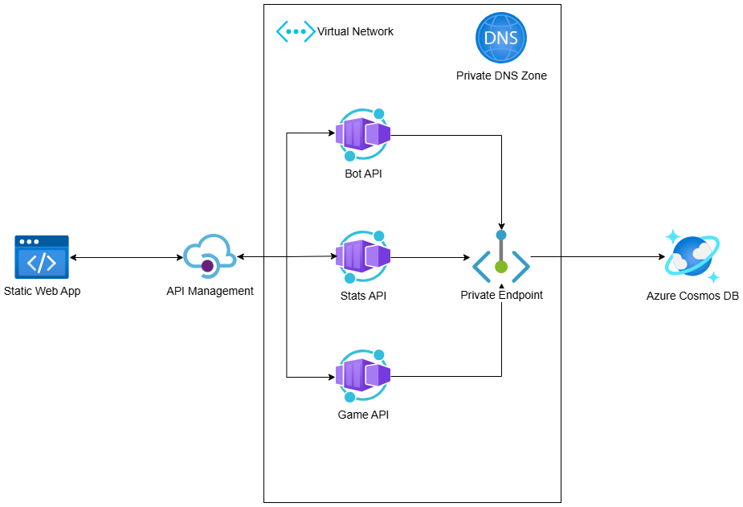

# Module 5 Exercise 1

In this exercise you will deploy a Private Endpoint for the CosmosDB resource so it can only be accessed privately.

## Estimated time: TODO minutes

## Learning objectives

- Secure your CosmosDB by implementing Private Endpoints.

## Prerequisites

To begin this module you will need the Azure resources that you deployed in the previous modules.

During this module you will also need the following PowerShell variables used previously:

- $location - location of the first region deployed in Module 0
- $apiResourceGroup  - name of your API Resource Group deployed in Module 1
- $vnetName - name of your VNET deployed in Module 1
- $cosmosDbAccount - name of your CosmosDB resource deployed in Module 1
- $dbResourceGroup - name of your Database Resource Group deployed in Module 1

## Architecture Diagram

The diagram of the app with the deployed resources for this exercise is the following:

Until now, the Cosmos DB resource was available to public internet. After this exercise, it will only be accessible from the Private Endpoint inside the Virtual Network.

## Step 1: Create a Private Endpoint for CosmosDB

You can create the Private Endpoint by following the commands provided in [Exercise1.ps1](./Exercise1.ps1).

## Step 2: Test the application

You can test the web app and see that it's working the same way that it did before. The difference now is that the CosmosDB resource is much more secure, knowing that only resources inside the virtual network can access it. Not only that your leaderboard data will be secured, but also the statestore data used by dapr.

All traffic between the database and other resources don't leave the virtual network when transferred to the Container Apps. Without the private endpoint, the data passes through the internet, posing a higher security risk.
