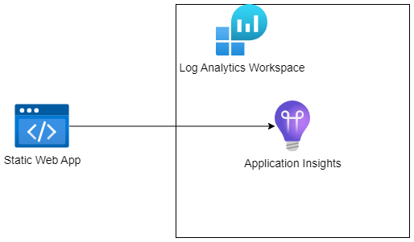

# Exercise 1

In this exercise you will deploy an **Azure Application Insights** resource that will monitor your Web Application. offering logs about users, sessions, events and more.

## Estimated time: TODO minutes

## Learning objectives

- Use Azure Application Insights for Web App monitoring

## Prerequisites

To begin this module you will need the Azure resources that you deployed in the previous modules.

During this module you will also need the following PowerShell variables used previously:

- $location - location of the first region deployed in Module 0
- $apiResourceGroup  - name of your API Resource Group deployed in Module 1
- $staticWebName - name of your Azure Static Web App resource
- $gameContainerUrl - url of your Game API container
- $apimUrl - endpoint for your Azure API Management resource(Gateway URL)

## Architecture Diagram

The diagram of the app with the deployed resources for this exercise is the following:

## Step 1: Deploy an Azure Application Insights resource

### 1.1 Deploy a Log Analytics Workspace Resource and save its ID

To use an Application Insights resource, it is recommended to link it to a Log Analytics Workspace. You can also deploy a standalone Application Insights, but it's deprecated and not available on some regions. You will deploy a Log Analytics Workspace so you won't have any issues with this exercise.

### 1.2 Name your Application Insights Resource

### 1.3 Create the Application Insights resource

> [!IMPORTANT]
> If prompted to install the extension *application-insights*, press **y**.

## Step 2: Redeploy the Static Web App with the new version

Now you will need to redeploy the Web App with the new code to communicate with the Application Insights resource.

### 2.1 Reconfigure the deployment workflow

To deploy the version of the app with the Application Insights functionality, you need to change the deployment workflow under `./github/workflows`, more exactly, you have to change

| Variable | New value |
| -- | -- |
| app_location | "/module-8-observability-and-monitoring/Exercise_1/RockPaperScissors" |
| api_location | "/module-8-observability-and-monitoring/Exercise_1/RockPaperScissorsAPI" |

You need to copy the Connection String of your resource. You can find it in the [Azure portal](https://portal.azure.com), by navigating to your newly created Application Insights resource, on the **Overview** tab next to **Connection String**.

### 2.2 Redeploy your Static Web App, and add the **INSIGHTS_CONNECTION_STRING** Environment Variable. Set its value to be the Connection String you just copied

## Step 3: Test the application and check Application Insights for events

Now you can play around with your web application and it should automatically record events inside Application Insights.

Open the [Azure portal](https://portal.azure.com) and navigate to your Application Insights Resource. You can now check the usage of the application, under the Usage tab. You can see the number of users of your application, or events regarding how they use the app, which pages they access etc.
